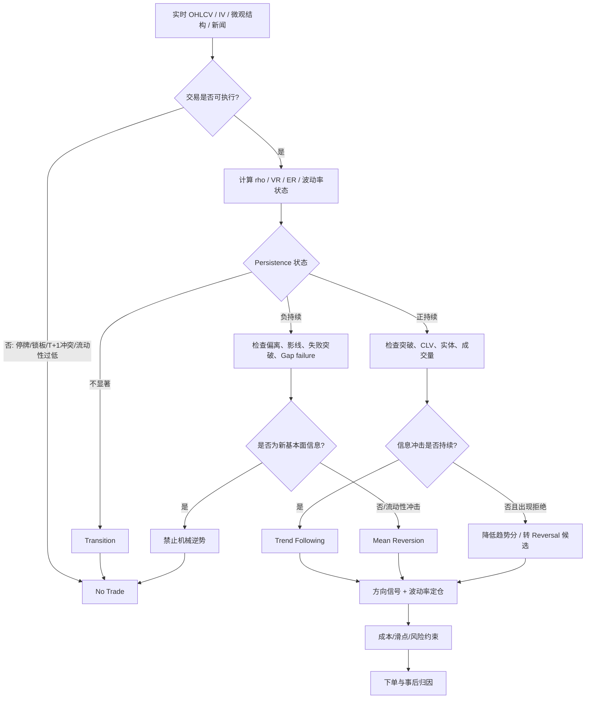

# 量化交易中趋势跟随与趋势反转/均值回归的策略适配：基于 K 线状态、波动率、成交量、序列依赖与市场微观结构的研究

## 执行摘要

**核心结论：不应根据单根 K 线形态直接决定“趋势跟随还是反转”。更稳健的做法，是把问题建模为一个“市场状态识别（regime classification）→策略门控（strategy gating）→方向信号→仓位/执行”的两阶段或三阶段系统。** 从经典实证看，趋势与反转完全可以在同一资产上、不同时间尺度共存：Moskowitz、Ooi 与 Pedersen 在 58 个流动性较高的股指、货币、商品和债券期货上发现过去 **1–12 个月收益具有持续性、而更长周期出现部分反转**；但 Huang 等对传统 time-series momentum 的资产逐一预测能力提出了重要质疑，说明“趋势”也不是无条件稳定存在。citeturn16search0turn20search3 A 股尤其如此：已有研究发现显著的日内动量与反转，同时 2023 年研究则发现中国股票市场月度短期动量不显著、短期反转更突出；另一项中国研究发现，当市场状态从形成期延续到持有期时动量较强，而**状态切换时动量甚至发生反转**。citeturn17search1turn17search2turn17search7

因此，本报告建议把实时策略选择的优先级设为：

> **可执行性/制度约束 → 收益序列持续性或反持续性 → 当前冲击是“信息型”还是“流动性型” → 波动率状态 → 突破/失败突破 → 成交量确认 → K 线实体、影线、跳空等几何特征。**

其中，**趋势跟随**更适合“正序列依赖 + 较高方向效率 + 有效突破 + 收盘靠近极值 + 波动率从低位扩张 + 成交量参与且价格冲击持续”的组合状态；**反转/均值回归**更适合“负序列依赖 + 价格显著偏离短期均衡 + 低趋势效率/震荡 + 假突破或跳空失败 + 长拒绝影线 + 流动性冲击”的组合状态。Campbell、Grossman 与 Wang 发现日收益自相关随成交量变化，Nagel 将短期反转收益解释为流动性提供回报；更进一步，Chiang、Kirby 与 Nie 的证据表明，**流动性需求造成的价格变化更容易反转，而新闻驱动的收益更容易延续**。所以“放量”绝不能机械解释为趋势确认，也不能机械解释为见顶。citeturn16search32turn16search15turn16search18

**波动率也不是方向因子。** Cboe 明确指出 VIX 是基于期权价格的预期波动率指标，属于非方向性预测，并不告诉投资者明天涨还是跌。citeturn19search6turn19search10 实务上应进一步区分“低波压缩后、伴随有效突破的波动率抬升”和“已经处于极端波动、流动性恶化并出现拒绝/失败突破的波动率冲击”：前者更偏趋势，后者更偏反转或至少应降低趋势仓位。Nagel 的研究甚至显示，在高 VIX/市场动荡期间，流动性提供型短期反转的预期收益和条件 Sharpe 会明显上升。citeturn16search15

**A 股需要单独建模。** 中国监管材料明确将 A 股股票描述为 T+1 交易，并在关于 T+0 的政策讨论中指出现阶段实施 T+0 时机不成熟；Qiao 与 Dam 的 Journal of Financial Markets 研究发现，中国股票平均隔夜收益为负，并提出 T+1“当天买入不能当天卖出”会形成开盘价格折价；另一篇研究也把中国特有的负隔夜收益与 T+1 联系起来。citeturn15search0turn15search4turn17search4turn17search0 这意味着：**A 股日内出现的均值回归机会即使统计成立，也可能因为当天新买头寸无法当日退出而不是可交易 alpha；反而要把 `close→next open`、`open→close`、`close→next close` 拆开建模。** 美股所谓 T+1 则是 2024 年 5 月 28 日开始实行的**标准结算周期**，并不是中国意义上的“当日买入股票不得当日卖出”，两者不能混淆。citeturn15search2turn15search6

最终建议采用三状态输出，而不是硬性二选一：

| 状态 | 典型条件 | 优先策略 | 实务动作 |
|---|---|---|---|
| **Trend** | 正自相关/VR>1；高趋势效率；有效突破；大实体、收盘靠近极值；波动由压缩转扩张；量价确认 | 趋势跟随 | 突破/回踩加仓，移动止损，波动率定仓 |
| **Mean-Revert** | 负自相关/VR<1；价格偏离 >1.5–2 ATR；低趋势效率；假突破/失败跳空；长拒绝影线；流动性冲击 | 反转/均值回归 | 逆极端方向交易，目标均线/VWAP，较短 time-stop |
| **Transition / No Trade** | 高波动但方向证据冲突；新闻事件；价差/冲击成本异常；Trend 与 Reversion 分数接近 | 暂不押注 | 降仓、等待下一根 K 线或微观结构确认 |

下面的结论应理解为**研究框架和可检验假设，而不是固定技术分析口诀**。经典 K 线研究的结果高度依赖市场、形态定义和持有规则；Lu、Chen 与 Hsu 甚至发现，同一组 K 线反转形态使用不同持有规则时，盈利结论会发生实质变化。citeturn18search7


## 核心机制与文献综述

### 趋势跟随：证据强，但高度依赖时间尺度

最有代表性的跨资产证据来自 Moskowitz、Ooi 与 Pedersen 的 *Time Series Momentum*。作者研究了 58 个流动性较高的股指、货币、商品和债券期货，发现收益在 **1–12 个月存在持续性，并在更长时间尺度部分反转**。这说明“趋势”和“均值回归”并不是两个互斥的市场世界，而可能仅仅是**同一价格生成过程在不同 horizon 上的不同表现**。citeturn16search0turn16search16

AQR 后续把类似时间序列趋势策略向历史回溯到 1880 年，报告其在多个历史时期持续获得正收益；研究机构的长期历史重建因此为“趋势不是近几十年数据挖掘偶然结果”的观点提供了重要支持。citeturn20search2turn20search21 但这一结论不能被解读为“任何单品种过去涨了未来就一定涨”：Huang、Li、Wang 与 Zhou 在 *Journal of Financial Economics* 重新检验后指出，逐资产 time-series regression 在样本内和样本外对传统 TSMOM 的支持有限，pooled regression 的显著性也存在统计推断问题。citeturn20search3turn20search7

**对本研究最重要的启示不是“趋势是否存在”这个二元问题，而是：趋势预测能力是条件性的，应由当前 persistence regime 决定是否激活。**

### 反转/均值回归：至少有三种不同来源

均值回归文献首先需要区分三个机制。

第一类是**较长期的价格均值回归/非随机游走**。Poterba 与 Summers 研究了股票价格中的暂时性成分，并指出 variance ratio 是检验均值回归的重要工具，不过其对部分备择假设的统计功效有限。citeturn19search8 Lo 与 MacKinlay 则用不同频率方差估计比较的方法，对 1962–1985 年美国周度股票收益的随机游走假设作出强烈拒绝。citeturn19search25 这意味着 `VR(k)` 是很自然的策略选择状态变量：**VR>1 对应累计变化比随机游走更“持续”，VR<1 则更偏反持续/均值回归**，但它最好被用作描述性 regime factor，而不是单独交易信号。

第二类是**短期流动性反转**。Nagel 在 *Review of Financial Studies* 中把短期反转策略收益解释为流动性提供回报，并发现这类回报与 VIX/市场压力高度相关。citeturn16search15 Pastor–Stambaugh 流动性指标同样建立在订单流引起随后价格反转这一思想之上。citeturn7search2

第三类是**行为型过度反应或信息不足导致的回归**。它与第二类最容易混淆。因此真正重要的是判断一次价格移动是不是“新信息”。Chiang 等发现，短期反转主要来自短期流动性需求；新闻驱动收益反而更容易延续，并且高换手股票可能从反转转向短期动量。citeturn16search6turn16search18

由此得到一个很实用的分类：

\[
\text{Price Shock}
\rightarrow
\begin{cases}
\text{Fundamental / information shock} & \Rightarrow \text{continuation prior ↑}\\
\text{Liquidity / inventory shock} & \Rightarrow \text{reversal prior ↑}
\end{cases}
\]

这比“放量上涨追涨、长上影做空”更接近现有资产定价和市场微观结构研究。

### 成交量不是简单的趋势确认变量

Campbell、Grossman 与 Wang 对股票收益与成交量的经典研究发现，对股票指数和大型个股而言，一阶日收益自相关倾向于随成交量增加而下降；作者用做市商吸收非信息型流动性需求的模型解释这一关系。citeturn16search5turn16search32 而较新的 Chiang 等研究又发现，当高换手更多代表信息驱动交易时，反转会减弱，极高换手组甚至出现短期动量。citeturn16search2turn16search18

所以推荐建立交互变量，而不是裸 `Volume_Z`：

\[
TrendVolume =
VolumeZ \times |CLV| \times I(\text{有效突破})
\]

\[
ReversalVolume =
VolumeZ \times WickReject \times I(\text{失败突破或价格回到原区间})
\]

其中 `CLV=(2C-H-L)/(H-L)`。同样的“放量”在第一种状态中支持趋势，在第二种状态中反而支持反转。

### K 线形态有信息，但单独使用的证据并不稳定

Lo、Mamaysky 与 Wang 把技术分析从主观“看图”转换为可统计检验的非参数模式识别，并应用于 1962–1996 年大量美国股票。其贡献的重要之处在于：**技术形态应该被精确定义、自动识别并接受统计检验，而不是凭视觉经验命名。** citeturn18search6turn18search21

具体到蜡烛图，Lu、Chen 与 Hsu 对 DJIA 成分股系统比较趋势定义与持有规则后发现，一些三日反转形态配合特定持有策略，在计入其设定的交易成本并考虑 data-snooping 后仍有盈利证据；但使用另一种持有规则时则没有显著正收益，而且结果会受市场波动状态影响。citeturn18search7 台湾市场的研究也采用多个两日 bullish/bearish reversal patterns 和不同退出逻辑进行检验。citeturn18search1turn18search5

所以本报告对长上影、长下影、十字星、大实体等的定位是：

> **它们是“当前 bar 内价格接受/拒绝程度”的交互特征，不是独立 alpha。**

### 中国市场的文献给出了特别强的 regime 证据

中国市场研究对本题尤其有价值。

Chu、Gu 与 Zhou 使用首半小时收益预测后续收益，发现中国市场同时存在显著日内动量和反转，且在加入前日收益、隔夜收益和星期效应后仍可观察到相关预测性；作者进一步指出交易成本会妨碍简单套利。citeturn17search1turn17search5

Yue、Li 与 Ruan 对美国“低换手反转、高换手短期动量”的结论在中国进行复制，结果发现中国样本中没有对应的短期动量，而**短期反转与负换手效应更明显**。citeturn17search2turn17search10

更直接与“策略切换”相关的是 Gao 的 *Signed Momentum in the Chinese Stock Market*：其研究发现，中国动量表现与市场状态高度相关；当形成期与持有期保持相同市场状态时动量存在，而发生状态转移时动量发生反转。citeturn17search7

这几项研究共同支持：

> **A 股策略研究中，“先做状态分类、再选择 trend/reversal”比把同一条动量或反转规则全年无条件运行，更符合已有实证。**

### 文献地图

| 研究主题 | 代表文献 | 方法/市场 | 主要成果 | 对策略选择的含义 |
|---|---|---|---|---|
| 跨资产趋势 | Moskowitz–Ooi–Pedersen | 58 个期货，time-series momentum | 1–12 月持续，长周期部分反转 citeturn16search0 | horizon 是第一状态变量 |
| 超长期趋势 | Hurst–Ooi–Pedersen/AQR | 历史数据回溯至 1880 | 跨长期经济环境的趋势证据 citeturn20search2 | 趋势是值得作为基准模型研究的结构性现象 |
| 趋势争议 | Huang et al. | 资产逐一/pooled regression 与 bootstrap | 传统 TSMOM 显著性遭到挑战 citeturn20search3 | 必须 OOS，不可把历史趋势当常数 |
| 随机游走/序列依赖 | Lo–MacKinlay | variance ratio | 拒绝美国周收益随机游走 citeturn19search25 | VR 可作为 regime factor |
| 长期均值回归 | Poterba–Summers | variance ratio | 研究股票价格暂时性成分 citeturn19search8 | `VR<1` 是反持续候选状态 |
| 流动性反转 | Nagel | reversal portfolio、VIX | 短期反转可视为流动性提供回报 citeturn16search15 | 流动性冲击优先 MR |
| 成交量×序列依赖 | Campbell–Grossman–Wang | 日收益自相关×volume | 自相关与成交量系统相关 citeturn16search32 | volume 必须与冲击类型互动 |
| 新闻与反转 | Chiang–Kirby–Nie | turnover/news sorting | 流动性需求→反转；新闻交易→延续 citeturn16search18 | news flag 是核心门控因子 |
| 图形模式 | Lo–Mamaysky–Wang | 自动非参数图形识别 | 将技术模式转化为统计问题 citeturn18search6 | 不使用主观形态命名 |
| K 线反转 | Lu–Chen–Hsu | DJIA、形态×退出规则 | 盈利性高度依赖 holding rule/市场状态 citeturn18search7 | 影线/实体必须条件化 |
| A 股日内 | Chu–Gu–Zhou | 前半小时预测 | 动量与反转均存在 citeturn17search1 | 日内不同时间段要分开 |
| A 股短期 | Yue–Li–Ruan | turnover×past return | 中国短期反转更显著 citeturn17search2 | 不能直接照搬美股量价规则 |
| A 股状态切换 | Gao | market-state conditioning | 状态持续→momentum；状态转换→reversal citeturn17search7 | 强支持 regime gating |
| A 股 T+1 | Qiao–Dam | overnight/intraday decomposition | T+1 与负隔夜收益/开盘折价相关 citeturn17search4 | 开盘/隔夜需独立建模 |


## K 线属性与因子清单

### 建议不要直接使用“阳线/阴线”，而应把每根 K 线数值化

定义当日：

\[
O_t,H_t,L_t,C_t,V_t
\]

推荐至少构造以下基础几何变量：

\[
Range_t=H_t-L_t
\]

\[
Body_t=\frac{|C_t-O_t|}{H_t-L_t+\epsilon}
\]

\[
UpperWick_t=
\frac{H_t-\max(O_t,C_t)}
{H_t-L_t+\epsilon}
\]

\[
LowerWick_t=
\frac{\min(O_t,C_t)-L_t}
{H_t-L_t+\epsilon}
\]

\[
CLV_t=
\frac{2C_t-H_t-L_t}
{H_t-L_t+\epsilon}
\]

\[
Gap_t=\frac{O_t-C_{t-1}}{C_{t-1}}
\]

其中，高低价本身也携带波动率信息；经典 Parkinson 方法以 high-low range 估计方差，后续研究指出在其模型假设下，经过正确缩放的 high-low range 比单纯 close-to-close 数据更有效率。citeturn19search23turn19search31 因而实体和影线不只是“图形”，也是 intrabar range 如何被分配的一种描述。

### 属性—统计意义—策略适配矩阵

下表中的“倾向”是**需要回测验证的条件假设**，而不是机械交易规则。

| K线/状态属性 | 建议量化方式 | 统计含义 | 趋势跟随适配状态 | 反转/均值回归适配状态 | 证据与判断 |
|---|---|---|---|---|---|
| **历史波动率** | `std(r,20)`、ATR、Parkinson RV | 当前收益分散度 | 从低位逐步抬升，同时突破成立、ρ>0 | 已处极端分位且冲击失败、ρ<0 | Range-based vol 有严格统计基础；但波动率本身无方向性。citeturn19search23 |
| **隐含波动率** | IV、IV percentile、IV−RV | 市场对未来波动的定价 | 只作风险/仓位过滤；不能单独判趋势 | 高 IV + 流动性冲击可提高反转风险溢价候选 | Cboe 明确称 VIX 为非方向性预期波动率。citeturn19search6turn19search10 |
| **波动率扩张** | `RV5/RV20`、ATR5/ATR20 | regime 是否由压缩转入活跃 | **低波→扩张+突破确认**较优 | 已高波→进一步 spike+拒绝形态，更偏 MR/no-trade | “高波=趋势”不成立；Nagel 发现高 VIX 下流动性反转回报上升。citeturn16search15 |
| **波动率收敛** | RV 短/长比下降、range percentile | 价格在收缩 | 暂不追趋势，等待 breakout | 在区间边界内部可做均值回归 | 属 regime 变量，突破方向需另行确认；建议实证检验 |
| **成交量/换手** | log-volume z-score、turnover percentile | 信息与流动性需求混合代理 | 高量 + 有效突破 + close near extreme | 高量 + rejected move/failed breakout | Campbell 与 Chiang 说明 volume 的作用依冲击性质而变，不能单独决定方向。citeturn16search32turn16search18 |
| **大实体 K 线** | `BodyRatio>p70/p80` | bar 内净方向移动较多 | 大实体且 CLV 接近 ±1、突破成立 | 若大实体已是极端伸展，随后出现失败确认才反转 | K 线盈利证据依 holding rule，单根实体不是充分条件。citeturn18search7 |
| **长上影线** | `UpperWick/Range` | 高价遭拒绝 | 上升趋势中若随后重新突破上影高点，仍可继续 trend | 延伸上涨后，上影>高分位、收盘回区间+高量，更偏 bearish reversal | 建议只作 interaction feature；传统 K 线形态证据依市场/持有方式变化。citeturn18search7 |
| **长下影线** | `LowerWick/Range` | 低价遭拒绝 | 若下降趋势后继续跌破影线低点，则不能视为反转 | 超跌、低位长下影、收回区间、高量且ρ<0，更偏 bullish reversal | 同上。citeturn18search7 |
| **十字/小实体** | Body/Range 极低 | 方向不确定/价格发现分歧 | 通常降低 trend confidence | 极端偏离后的十字+拒绝可提高 MR 分 | 不宜独立交易，最好作为 uncertainty 特征。citeturn18search6turn18search7 |
| **跳空高开/低开** | `Gap/ATR` 或 gap percentile | 隔夜信息/订单不平衡 | 大 gap + 开盘后同方向扩展+收盘靠极值 | gap 后快速回补、close 穿回开盘/前区间 | 应先区分 news shock 与 liquidity shock；A 股还受 T+1 隔夜结构影响。citeturn16search18turn17search4 |
| **连续上涨/下跌** | signed streak、N-day return | 价格持续性 | 正ρ、VR>1、ER高时 streak 是趋势确认 | ER低、VR<1、偏离极端时 streak 更像过度伸展 | 跨资产研究显示 1–12 月持续、较长周期又可能反转。citeturn16search0 |
| **有效突破** | `C > max(H_{t-N:t-1})` 或相反 | 新价格区间被收盘接受 | **强趋势信号候选** | — | 应配合 ER、ρ、成交量，而非单用新高 |
| **失败突破** | `H>priorHigh` 但 `C<priorHigh` | 极端价未被接受 | 给趋势扣分 | **强 MR 候选**，尤其长影线+量能冲击 | 与 K 线“拒绝”结构自然结合；需 OOS 验证 |
| **价格偏离均线/VWAP** | `(C-EMA)/ATR`、z-score | 与局部均衡的标准化距离 | trend regime 下过度依赖此因子会过早逆势 | \|z\| 高且ρ<0/ER低时核心 MR 因子 | 均值回归本质上要求先定义“mean”；不能默认 EMA 就是真实均值 |
| **一阶收益自相关** | rolling `Corr(r_t,r_{t-1})` | 最直接的短期持续/反持续指标 | `ρ1>0` | `ρ1<0` | 量价与自相关关系有经典实证；但高频负相关要警惕微观结构。citeturn16search32 |
| **Variance Ratio** | `VR(k)=Var(r_k)/(k Var(r_1))` | 多尺度持续性 | VR>1 | VR<1 | Lo–MacKinlay/Poterba–Summers 文献的核心工具之一。citeturn19search25turn19search8 |
| **趋势效率 ER** | `|C_t-C_{t-N}|/Σ|ΔC|` | 净位移/总路径长度 | 接近 1 更有利于 trend | 接近 0 更利于 range/MR | 推荐作为工程型状态变量，与自相关联合使用 |
| **Bid–ask/微观结构** | spread、order imbalance、Amihud、quote data | 观察到的反转是否只是交易摩擦 | spread 正常、impact 持续更可信 | liquidity shock 可产生真实反转，但 bid–ask bounce 会制造伪负自相关 | 高频反转尤其需要剔除 bid–ask bounce；经典 spread estimator 就利用了这种负序列相关。citeturn7search9turn7search19 |
| **A股 T+1** | overnight、open-close 独立收益；available-to-sell | 买入后退出时点受限 | 多日趋势信号受影响相对较小 | 当日“抄底→收盘卖出”可能根本不可执行 | T+1 与中国负隔夜/开盘折价存在专门实证。citeturn17search4turn17search0 |

### 最重要的交互，而不是单因素

建议优先检验这些条件组合：

**趋势组合：**

\[
TrendCandidate=
I(\rho_1>0)
\cdot I(VR>1)
\cdot I(ER>p_{70})
\cdot I(Breakout)
\]

再由成交量、实体、CLV 和波动率扩张加分。

**反转组合：**

\[
ReversalCandidate=
I(\rho_1<0)
\cdot I(VR<1)
\cdot I(|Distance|>q)
\cdot I(FailedBreakout\lor WickReject)
\]

再由流动性冲击、异常量能和 gap failure 加分。

特别要避免下面四条常见但统计上过度简化的规则：

> “放量必延续”；“长上影必跌”；“高 VIX 必看空”；“连续上涨越多越应该做空”。

现有研究至少已经清楚说明，成交量需要区分信息与流动性冲击，VIX 不提供方向预测，而持续性本身也随 horizon 和 market state 改变。citeturn16search18turn19search10turn16search0turn17search7


## 市场与制度差异

### A 股：T+1 不只是执行细节，而会改变信号本身

中国证监会公开材料将 A 股股票描述为 T+1 交易；2023 年证监会在关于是否实施 T+0 的答记者问中表示，现阶段实施 T+0 的时机不成熟，并特别讨论了投资者结构、程序化交易以及投机/操纵风险。citeturn15search0turn15search4

这与美股的 T+1 **不是一个概念**。美国 SEC 于 2024 年 5 月 28 日把股票、债券、ETF 等适用证券的**标准结算周期**从 T+2 缩短为 T+1；这里的 T 指成交日、T+1 指结算日。citeturn15search2turn15search14

对于策略研究，更关键的是中国学术证据。Qiao 与 Dam 发现中国股票平均隔夜收益为负，并把这一现象与“当天买入不能当天卖出”的 T+1 交易规则联系起来，认为该约束会导致日开盘价格折价。citeturn17search4 Zhang 的研究也发现中国市场存在显著负隔夜收益，并通过不同交易制度资产/市场的比较支持 T+1 机制解释。citeturn17search0

因此，A 股不能直接回测：

```text
09:45 出现超跌长下影 → 买入
14:30 回到 VWAP → 卖出
```

若股票是当天新买入，这类策略即使在无交易约束的分钟数据上有漂亮 Sharpe，也可能不是可实施策略。

更合理的是拆成：

\[
r^{ON}_{t}=\frac{O_t}{C_{t-1}}-1
\]

\[
r^{ID}_{t}=\frac{C_t}{O_t}-1
\]

\[
r^{CC}_{t}=\frac{C_t}{C_{t-1}}-1
\]

分别测试：

- 前一日 K 线状态对 `next open` 的影响；
- 当日开盘状态对 `open→close` 的影响；
- 当天买入并在**最早可退出时点**退出时的真实 PnL。

否则很容易把制度性不可交易收益当成 alpha。中国日内研究已经表明，不同日内时间窗口确实存在不同方向的可预测性。citeturn17search1

### A 股还要特别处理涨跌幅限制、停牌和卖出可用量

即使统计信号正确，实际成交还可能受到停牌、极端行情下无法成交、涨跌幅限制导致的成交价格截断等问题影响；因此 A 股事件回测不应默认 `next_open` 一定可以全部成交。对本题而言，这一点对**逆向抄底策略尤其重要**：发生极端下跌时，历史数据库里会记录一个很有吸引力的“理论价格”，但真实资金可能无法在该价格成交或及时退出。

因此推荐把成交模型从：

\[
FillPrice=NextOpen
\]

改成：

\[
Fill =
I(\text{tradable})
I(\text{not locked})
I(\text{available-to-sell})
\times PriceModel
\]

并把无法成交订单向后延迟，而不是直接删除。

### 中国短期反转证据强于简单照搬美股高换手动量

Yue 等发现，在其中国样本中，美国市场常见的“低换手短期反转、高换手短期动量”结构并没有简单复制出来，结果更支持中国市场的短期反转。citeturn17search6turn17search10 Gao 的研究进一步说明，市场状态是否发生切换对中国动量的正负号非常重要。citeturn17search7

所以 A 股不建议直接使用：

\[
HighTurnover \Rightarrow Trend
\]

而应改成：

\[
HighTurnover
+
NewsPersistence
+
BreakoutAcceptance
+
PositiveAutocorrelation
\Rightarrow Trend
\]

否则：

\[
HighTurnover
+
WickReject
+
FailedBreakout
+
NegativeAutocorrelation
\Rightarrow Reversal
\]

### 美股、期货、外汇的策略自由度不同

| 市场 | 制度/微观结构重点 | 对趋势跟随 | 对反转/MR | 研究实现重点 |
|---|---|---|---|---|
| **A股现金股票** | 中国意义 T+1；卖空可获得性有限；极端行情成交约束 | 多日趋势天然更容易实现 | 日内新买入后即时平仓受限制 | 必须分 overnight/intraday、建模 available-to-sell citeturn17search4turn15search4 |
| **美股现金股票** | SEC 的 T+1 是结算周期，而非 A 股式当日卖出限制 | 长/短可做，但具体账户和证券有额外规则 | 日内 MR 在执行结构上更自然 | spread、borrow、short fee、market impact citeturn15search2 |
| **股指/商品期货** | CME 多类产品接近全天交易，可直接建立 long/short | 非常适合对称 time-series trend | 也适合短周期反转 | roll、保证金、夜盘流动性、跳空/事件风险；CME 明确强调部分指数期货接近 24 小时交易并易于做空。citeturn15search11turn15search7 |
| **外汇** | 与股票中央交易所结构不同；点差、融资和事件时段流动性非常重要 | 天然适合方向多空 | 高频 MR 对 spread 极敏感 | spread、roll/swap、流动性时段、杠杆风险 |

**因此不建议用同一阈值跨市场复制。** 对期货而言 `ρ1`、ER 和 breakout 通常可以对 long/short 对称处理；A 股现金股票则应建立“信号模型”和“可执行模型”两个独立层。

### A 股交易成本不能只填一个 commission

截至本次检索，上交所公开费用页面列示 A 股竞价交易经手费为成交金额的 **0.00341%，双边收取**；上交所也说明该费率是 2023 年由 0.00487% 下调 30% 后形成的。citeturn20search0turn20search29 这只是交易总成本的一部分，并不等同于投资者最终 all-in cost。

推荐把 A 股成本写成：

\[
TC =
Commission+
Exchange/RegulatoryFees+
TransferFees+
Tax+
HalfSpread+
MarketImpact+
T1OpportunityCost
\]

其中最后一项不是直接收费，却可能是反转策略最重要的经济摩擦之一。


## 实证与回测设计

### 研究问题应该拆成“状态预测”和“策略收益”两层

最常见的方法论错误是：

> 先试几十种 K 线规则 → 选回测最好的一条 → 再解释“为什么它是趋势/反转状态”。

正确顺序应更接近：

\[
X_t
\rightarrow
P(Regime_{t+1}=\text{Trend/MR/Transition})
\]

然后才是：

\[
Regime_t + DirectionSignal_t
\rightarrow Position_{t+1}
\]

也就是说，**“应该选趋势还是反转”与“应该做多还是做空”是两个不同问题。**

例如：

- `ER high + VR>1` 判断是 **trend regime**；
- `20-day return > 0` 决定在该 trend regime 中做多；
- `ER low + VR<1 + distance extreme` 判断是 **MR regime**；
- `price above EMA/VWAP` 决定在 MR 中做空或减持。

这样可以明显减少逻辑循环。

### 样本设计

推荐至少建立三个 panel：

**A 股 panel**：点时点可得（point-in-time）的沪深股票池或指数历史成分，保留退市证券，记录 ST/停牌/涨跌停/上市天数等可交易状态；同时分别构造大盘股、中盘股、小盘股子样本。

**跨资产 panel**：主要股票指数期货、国债期货、商品期货及主要货币，以验证 trend/MR 状态识别是否跨资产稳定。Moskowitz 等正是在股指、债券、货币、商品期货之间发现跨资产 TSMOM 证据。citeturn16search0

**频率 panel**：至少日线 + 30 分钟或 60 分钟。因为文献已经显示同一市场在不同 horizon 可能同时出现趋势和反转，中国日内研究与月度短期研究的结论尤其说明这一点。citeturn17search1turn17search2

推荐不要把整个历史随机打散，而采用 expanding/rolling walk-forward，例如：

```text
Train        Validation      Test
──────────── ─────────── ───────────
60%             20%          20%

然后窗口向前滚动
```

任何阈值、因子方向、持仓期、止损参数都必须只由 train/validation 决定。

### 因子构造建议

| 类别 | 推荐变量 | 公式/实现 |
|---|---|---|
| Return | `ret_1`,`ret_5`,`ret_20` | `C/C.shift(k)-1` |
| Gap | `gap` | `O/C.shift(1)-1` |
| Body | `body_ratio` | `abs(C-O)/(H-L)` |
| Upper/Lower Wick | `uw`,`lw` | 影线长度 / range |
| Close location | `CLV` | `(2C-H-L)/(H-L)` |
| Volatility | `RV5`,`RV20`,`ATR`,`Parkinson` | close-to-close + OHLC range |
| Vol regime | `RV5/RV20` | >1 扩张、<1 收敛 |
| Volume | `volume_z` | rolling z-score(log volume) |
| Streak | `signed_streak` | 连涨为正、连跌为负 |
| Autocorrelation | `rho1` | rolling Corr(`r`,`r.shift(1)`) |
| Variance ratio | `VR5` | `Var(5-period sum)/(5 Var(r))` |
| Efficiency | `ER20` | `abs(C-C20)/sum(abs(diff(C)))` |
| Stretch | `distance_ATR` | `(C-EMA20)/ATR14` |
| Breakout | `BO20` | close vs lagged 20-day high/low |
| Failure | `failed_BO` | intrabar break but close back inside |
| Liquidity | spread/Amihud/order imbalance | 数据条件允许则加入 |
| IV | `IV percentile`,`IV-RV` | 期权市场可得时加入 |

高低价构造波动率有经典理论与实证基础。citeturn19search23 自相关和 variance-ratio 则分别对应短期 persistence 与多尺度随机游走偏离。citeturn16search32turn19search25

### 阈值设计：使用滚动分位数，不要迷信固定数值

例如“大实体 >60%”“长影线 >50%”“z-score >2”可以作为研究起点，但不应该被当成自然常数。

更稳健的定义是：

\[
LargeBody_t =
I(Body_t>P_{70}^{rolling})
\]

\[
LongWick_t =
I(Wick_t>P_{80}^{rolling})
\]

\[
VolShock_t =
I(RV_t>P_{90}^{rolling})
\]

\[
ExtremeDistance_t =
I(|Dist_t|>P_{90}^{rolling})
\]

这样能部分适应从低波市场向高波市场的结构变化。

尤其不要遍历：

```text
body = 0.51, 0.52, …, 0.90
wick = 0.31, 0.32, …, 0.80
lookback = 5, 6, …, 250
holding = 1, 2, …, 60
```

然后只汇报最优组合。这正是 factor zoo / backtest overfitting 的典型来源。Harvey、Liu 与 Zhu 在大规模因子检验文献中指出，在大量候选因子被测试后，传统 `t>1.96` 的显著性标准过于宽松，并提出新发现需要明显更高的统计门槛。citeturn7search14 Bailey 等则专门提出 Probability of Backtest Overfitting（PBO），用于量化从大量策略配置中挑选“冠军”造成的过拟合风险；Deflated Sharpe Ratio 则针对多重测试和非正态收益对 Sharpe 的显著性进行校正。citeturn14search2turn14search3

### 持仓周期必须与信号 horizon 匹配

建议不要一开始优化一个“万能持有期”，而是独立测试：

| 信号频率 | Trend 候选持有 | MR 候选持有 | 关键风险 |
|---|---:|---:|---|
| 5–30 min | 数 bar 至日终/次日 | 1–数 bar | spread、bid–ask bounce |
| 60 min | 数小时至数日 | 数小时至次日 | overnight |
| Daily | 3–20 天起步测试 | 1–5 天起步测试 | gap、event |
| Weekly/monthly | 数月 | 数周至数月 | regime transition |

这里的周期是**实验网格而不是研究结论**。文献已经证明 horizon 能改变收益持续性的符号：Moskowitz 等发现 1–12 月持续、之后部分反转。citeturn16search0

对 A 股日线策略，则必须保证当日新买头寸不被模型错误地在同一交易日卖出。citeturn17search4

### 交易成本与滑点

建议使用逐笔或至少逐 bar 的成本，而不是回测结束时统一扣年化 1%。

基础模型：

\[
Cost_t=
Turnover_t(c_{fixed}+0.5Spread_t)
+Impact_t
+Tax_t
\]

市场冲击可以先用工程化平方根模型做压力测试：

\[
Impact \approx
\lambda\sigma
\sqrt{\frac{Q}{ADV}}
\]

但 `λ` 必须由真实成交或高频数据校准，不应把公式本身当成事实常数。

至少跑：

\[
TC=\{0.5\times,1\times,2\times,3\times\}
\]

四组成本情景。

这是反转策略尤其重要的环节，因为短期反转往往与流动性提供高度相关；其毛收益很可能正是对承担冲击和流动性风险的补偿。citeturn16search15

### 风险管理

Trend 与 MR 的风险管理逻辑应不同。

**Trend 策略**更适合：

- volatility target；
- trailing ATR stop；
- 单品种风险预算；
- trend score 下降逐步减仓，而不是一触均线全平；
- 对急剧 volatility spike 降杠杆。

**Mean Reversion**更适合：

- 较短 time stop；
- 超过第二/第三偏离阈值不无限加仓；
- 明确禁止在确认后的 fundamental news trend 上持续逆势加码；
- extreme liquidity regime 降低单笔规模；
- 在 A 股加入 T+1 overnight-gap 风险预算。

新闻型收益可能持续而不是反转，因此“越跌越买”在信息事件中尤其危险。citeturn16search18

### 评估指标

单看胜率是不够的。至少同时报告：

| 指标 | 用途 |
|---|---|
| CAGR / annualized return | 长期收益水平 |
| Annualized volatility | 风险规模 |
| **Sharpe** | 总风险调整收益 |
| **Information Ratio** | 相对基准主动收益质量 |
| **Maximum Drawdown** | 最严重资金回撤 |
| Calmar | CAGR/MDD |
| **Win Rate** | 正收益交易占比 |
| Average Win / Average Loss | 防止“高胜率、小赚大亏” |
| Profit Factor | 盈亏总额比 |
| Skewness | 是否存在负尾 |
| Excess Kurtosis | fat-tail 风险 |
| VaR / Expected Shortfall | 尾部损失 |
| Turnover | 成本和容量代理 |
| Capacity / ADV participation | 规模可扩展性 |
| Beta / factor exposures | 是否只是隐含市场方向 |
| OOS t-stat / DSR / PBO | 防止过拟合 |

最关键的不是全样本 Sharpe，而是**条件绩效矩阵**：

\[
E[R^{Trend}\mid TrendScore\ Quintile]
\]

\[
E[R^{MR}\mid ReversalScore\ Quintile]
\]

以及：

```text
                 Low Vol   Mid Vol   High Vol
Trend regime
MR regime
Transition
```

如果分类器有效，应该看到**Trend 策略的超额收益随着 TrendScore 单调改善，同时 MR 策略的收益随 ReversionScore 单调改善**。否则所谓“regime classifier”可能只是事后叙事。

### 稳健性检验清单

最重要的测试包括：

1. point-in-time 股票池，保留退市股票；
2. corporate action 调整只使用当时可得信息；
3. blocked/walk-forward OOS；
4. 参数稳定性图，而不是只报告最优点；
5. block bootstrap；
6. 随机打乱 signal timestamps 的 placebo；
7. 成本 ×0.5、×1、×2、×3；
8. 日线/60min/30min 多频率；
9. 大中小盘分别测试；
10. 牛市/熊市、高低波、流动性压力分别测试；
11. 中国市场分别统计 overnight 和 intraday；
12. DSR/PBO/多重检验修正。citeturn14search2turn14search3turn7search14


## 实时决策框架

### 推荐的两层评分结构

以下是本报告根据上述文献综合得到的**研究起始评分表，不是文献直接给出的“最佳参数”**。分位数和分值必须在训练集冻结，再进行样本外验证。

| 实时条件 | Trend 分 | Reversion 分 | 理由 |
|---|---:|---:|---|
| `ρ1>0.05` 且 `VR5>1.05` | +2 | 0 | persistence 同方向 |
| `ρ1<-0.05` 且 `VR5<0.95` | 0 | +2 | anti-persistence |
| `ER20 > rolling P70` | +1 | 0 | 价格路径方向效率高 |
| `ER20 < rolling P30` | 0 | +1 | 震荡/来回交易较多 |
| Close 突破 lagged N-day high/low | +2 | 0 | 新价格区间被收盘接受 |
| intrabar 突破但 close 回原区间 | −1 | +2 | failed breakout |
| `BodyRatio>P70` 且 `|CLV|>0.5` | +1 | 0 | bar 收盘方向明确 |
| 上/下影 >P80，且收盘反向 | −0.5 | +1 | rejection |
| `RV5/RV20>P70`，此前低波且突破成立 | +1 | 0 | compression→expansion |
| range/RV >P90 且出现失败突破 | −1 | +1.5 | volatility shock/rejection |
| volume z>1 且强收盘/有效突破 | +1 | 0 | participation confirmation |
| volume z>1 且长影/失败突破 | 0 | +1 | liquidity/rejection candidate |
| 大 gap 后继续同方向收盘 | +1 | 0 | gap acceptance |
| gap 后收回前一区间 | 0 | +1 | gap failure |
| `|C-EMA|/ATR >1.5~2` | 0 | +1.5 | extreme displacement |
| 有明确新闻，价格冲击持续 | +2 | −2 | 新闻型收益较易延续 citeturn16search18 |
| 无新闻、spread/impact 激增且迅速回收 | −1 | +2 | liquidity-shock hypothesis citeturn16search15 |
| A股新买头寸需要同日退出才能实现 | 0 | −3/禁用 | T+1 不可执行 citeturn17search4 |
| IV/VIX 单纯处于高位 | 0 | 0 | IV 是波动率而非方向信号 citeturn19search10 |

### 初始决策阈值

可以先采用如下未优化规则做 baseline：

\[
S_T=\sum TrendScore
\]

\[
S_R=\sum ReversionScore
\]

**趋势：**

\[
S_T\ge6,\quad S_T-S_R\ge2
\]

则激活 Trend strategy。

**反转：**

\[
S_R\ge6,\quad S_R-S_T\ge2
\]

则激活 Mean-Reversion/Reversal strategy。

**弱状态：**

\[
4\le\max(S_T,S_R)<6
\]

只允许半仓，或要求下一根 K 线确认。

**Transition：**

\[
|S_T-S_R|<2
\]

不交易，或者只运行与方向无关的低风险策略。

这里最重要的一点是：

> **No Trade 必须是真正的第三种策略，而不是失败时才被动出现的状态。**

市场状态转换正是动量最容易发生失效甚至反转的时候，中国 market-state 研究已经直接给出相应证据。citeturn17search7

### 策略选择流程



### 一个更适合机构研究的概率版本

评分模型成熟后，应从硬规则升级为：

\[
p_T=P(\text{future continuation}\mid X_t)
\]

\[
p_R=P(\text{future reversal}\mid X_t)
\]

并使用预期净收益：

\[
EV_T=p_T\mu_T-(1-p_T)L_T-TC_T
\]

\[
EV_R=p_R\mu_R-(1-p_R)L_R-TC_R
\]

选择：

\[
Strategy_t=
\arg\max\{EV_T,EV_R,0\}
\]

这样可以自然解决一个关键问题：

**即使某状态“更像反转”，如果 A 股 T+1、价差和冲击成本使净 EV<0，也应该选择 No Trade，而不是强行做反转。**


## 可视化与可复现实现

### 价格与状态因子时间序列

最建议同时画：

- normalized price；
- `ER20`；
- `RV5/RV20`；
- `rho1` 或 VR；
- 背景标记 Trend/MR/Transition。

这样可以肉眼检查模型究竟是在**趋势中后段才追入**，还是能在压缩→突破早期切换。

下面是本报告为研究框架生成的**合成数据方法示意图，并非任何真实资产回测结果**：


代码中同时输出 `factors_and_scores.csv`，方便逐日期检查哪些因子造成了状态切换。

### 因子相关性热图

相关性热图应重点检查：

- `body_ratio` 与 `CLV` 是否高度冗余；
- `RV`、range、ATR 是否形成一个几乎相同的 volatility cluster；
- `rho1` 与 `VR` 是否提供独立信息；
- wick 特征是否只是 range/volatility 的另一种表达；
- `distance_ATR` 是否实际等价于过去收益。

示例：


对正式研究，仅看 Pearson correlation 仍不够；建议再做 Spearman、mutual information，以及 conditional IC。

### 策略绩效比较

至少绘制四条真实策略线：

```text
Buy & Hold
Trend only
Mean Reversion only
Regime-Switching Trend+MR
```

并另画：

```text
Gross PnL
Net PnL after cost
Net PnL at 2× cost
```

示例模板目前对合成数据运行出的结果如下：


**这里的示例故意没有优化成漂亮回测。** 默认合成样本和默认阈值下，模板当前 Sharpe 约为 **−0.36**、最大回撤约 **−26%**；这恰好说明代码的用途是展示**如何构造因子、如何做 regime gating、如何纳入 T+1/成本并检查失败案例**，而不是提供一组经过优化的“盈利参数”。

### 可复现代码与数据路径

本报告已生成完整 Python 模板，依赖 `numpy + pandas + matplotlib`，可直接读取含 `open/high/low/close/volume` 的 CSV；若存在 `iv` 列则自动加入隐含波动率相关变量。模板实现了：

- gap、实体、上下影线、CLV；
- historical volatility、Parkinson range vol；
- volume z-score；
- signed streak；
- rolling autocorrelation；
- variance ratio；
- efficiency ratio；
- EMA/ATR 偏离；
- breakout / failed breakout；
- gap failure；
- Trend/Reversion 双评分；
- Transition/No-trade gate；
- A 股简化版 long-only T+1 lock；
- 交易成本；
- Sharpe、Sortino、最大回撤、胜率、偏度、峰度；
- 三类示例图。

**[下载可复现 Python 研究模板](sandbox:/mnt/data/trend_reversion_research/trend_reversion_regime_template.py)**

**[下载示例因子与评分数据](sandbox:/mnt/data/trend_reversion_research/demo_output/factors_and_scores.csv)**

**[下载示例回测逐日数据](sandbox:/mnt/data/trend_reversion_research/demo_output/backtest.csv)**

**[下载示例绩效指标](sandbox:/mnt/data/trend_reversion_research/demo_output/metrics.csv)**

外部研究框架方面，Microsoft 的开源 Qlib 是面向量化研究、建模和生产实现的 Python 平台，可用于把上述特征迁移到更完整的 point-in-time 数据、模型训练和回测体系。fileciteturn2file0L2-L6

GitHub：`https://github.com/microsoft/qlib`

AQR 也公开了与 Moskowitz–Ooi–Pedersen 原始 time-series momentum 研究相关的数据集入口；其原始研究数据采用 12 个月 TSMOM / 1 个月持有期，并覆盖 58 个流动性较高的合约，可作为跨资产趋势 baseline 的复现起点。citeturn10search14


## 研究限制、后续方向与参考资料

### 主要研究限制

**第一，K 线只告诉我们 OHLC 极值和收盘结果，却不知道 bar 内真实路径。** 同一根长上影 K 线可能由“先涨后跌”形成，也可能由复杂的多次往返形成；对高频策略而言，两者的订单流机制完全不同。因此日线 K 线模型若表现良好，下一步应加入 intraday order flow、spread、depth 和 trade imbalance。

**第二，负自相关不等于可盈利反转。** Bid–ask bounce 本身就可以机械制造短周期负自相关，因此分钟级 MR 必须使用可成交 bid/ask 或 midquote 回测，而不能只使用 last price。相关微观结构文献明确利用 bid–ask bounce 导致的负序列相关来估计交易价差。citeturn7search9turn7search19

**第三，趋势/均值回归不存在一个跨 horizon 的永久标签。** MOP 的结果本身就是 1–12 月持续而更长周期部分反转，中国市场又存在日内动量/反转并存及月度短期反转。citeturn16search0turn17search1turn17search2 因此“某股票是趋势品种”“某市场是均值回归市场”这种静态分类过于粗糙。

**第四，volatility 与 volume 都是“状态强度”变量，不是天然方向变量。** VIX 明确不提供方向预测；成交量可能是基本面信息交易，也可能是被动流动性需求。citeturn19search10turn16search18

**第五，K 线形态容易发生 data mining。** 当研究者同时搜索几十种蜡烛形态、窗口、阈值、止盈止损和持有周期时，名义 Sharpe 会被严重抬高。蜡烛图文献本身已经显示，盈利结论会随着 trend definition 与 holding strategy 明显变化；现代 backtest 文献则进一步发展出 PBO 和 Deflated Sharpe 等专门工具。citeturn18search7turn14search2turn14search3

**第六，A 股制度本身可能产生统计现象。** 负隔夜收益、开盘行为和日内收益不能简单解释为投资者心理；T+1 的论文证据提示制度约束本身就可能改变均衡价格与交易行为。citeturn17search4turn17search0

### 最值得继续深入的研究方向

最有价值的后续方向并不是增加更多 K 线名字，而是研究三个隐变量：

\[
\boxed{\text{Persistence}}
\qquad
\boxed{\text{Information vs Liquidity}}
\qquad
\boxed{\text{Regime Transition Probability}}
\]

具体而言，研究优先级可设为：

**市场状态转移模型。** 用 HMM、Markov switching、change-point detection 或 Bayesian filtering 直接估计：

\[
P(S_{t+1}\neq S_t)
\]

因为中国实证已经表明 market-state transition 本身可能把 momentum 变成 reversal。citeturn17search7

**信息冲击分类。** 把公告、财报、分析师事件、宏观数据、新闻与纯 OHLCV 结合，回答“这根大阳线究竟是信息更新，还是短期买压”；现有新闻—反转文献表明这很可能比单纯 volume 更重要。citeturn16search18

**多尺度模型。** 同时输入：

\[
5m,\;30m,\;Daily,\;Weekly
\]

并允许：

```text
Weekly = Trend
Daily  = Trend
30m    = Mean Reversion
```

同时成立，而不是强迫整只资产只有一个 regime。

**A 股制度性实验。** 把同一信号分别测在 A 股现金股票、可 T+0 的相关产品以及期货/其他市场上，能够帮助识别“真正的行为 alpha”和“交易制度制造的收益结构”。证监会公开材料本身也显示不同 ETF/底层资产可能有不同 T+0/T+1 属性，为准实验设计提供了方向。citeturn15search4

**真正的执行层研究。** 最终应把 classifier 的目标从：

\[
P(r_{t+1}>0)
\]

升级成：

\[
E[PnL_{net}\mid
spread,\ depth,\ ADV,\ T+1,\ fill\ probability]
\]

因为策略选择真正需要最大化的是**可成交的净预期收益**，而不是方向预测准确率。

### 综合判断

把全部文献与市场制度放到一起，本报告给出的策略选择原则可以压缩为一句话：

> **趋势跟随应交易“被市场持续接受的新价格”；均值回归应交易“暂时偏离但未被市场持续接受的新价格”。**

“接受”最重要的统计证据不是某一种蜡烛形状，而是：

\[
\text{Persistence}
+
\text{Directional Efficiency}
+
\text{Breakout Acceptance}
+
\text{Persistent Volume/Information Impact}
\]

“拒绝”最重要的证据则是：

\[
\text{Anti-Persistence}
+
\text{Extreme Displacement}
+
\text{Failed Breakout}
+
\text{Wick/Gap Rejection}
+
\text{Liquidity Shock}
\]

这也解释了为什么**同一个“放量大阳线”在不同环境下可以产生完全相反的策略结论**：如果它来自新信息、收盘突破并在随后交易中保持价格影响，它更像趋势；如果它来自短暂的流动性需求、留下拒绝影线并迅速跌回原区间，它更像均值回归。相关实证明确区分了新闻驱动的持续与流动性驱动的反转。citeturn16search18turn16search15

### 参考论文、监管资料与研究资源索引

| 索引 | 来源 | 主要用途 / URL |
|---|---|---|
| **R-A1** | Moskowitz, Ooi & Pedersen, *Time Series Momentum*, JFE 2012 citeturn16search0 | 跨资产趋势核心论文。`https://www.sciencedirect.com/science/article/pii/S0304405X11002613` |
| **R-A2** | Hurst, Ooi & Pedersen, *A Century of Evidence on Trend-Following Investing* citeturn20search2 | 趋势长期历史证据。`https://www.aqr.com/Insights/Research/Journal-Article/A-Century-of-Evidence-on-Trend-Following-Investing` |
| **R-A3** | Huang, Li, Wang & Zhou, *Time-series momentum: Is it there?*, JFE 2020 citeturn20search3 | 对传统 TSMOM 显著性的关键反证/争议。`https://www.sciencedirect.com/science/article/abs/pii/S0304405X19301953` |
| **R-A4** | AQR, *Time Series Momentum* research page citeturn16search24 | 原研究概览与数据相关入口。`https://www.aqr.com/Insights/Research/Journal-Article/Time-Series-Momentum` |
| **R-M1** | Lo & MacKinlay, *Stock Market Prices Do Not Follow Random Walks* citeturn19search25 | Variance Ratio / 序列依赖基础。`https://web.mit.edu/Alo/www/Papers/lo-mackinlay-88.html` |
| **R-M2** | Poterba & Summers, *Mean Reversion in Stock Prices* citeturn19search8 | 长期均值回归与 variance ratio。`https://ideas.repec.org/p/nbr/nberwo/2343.html` |
| **R-M3** | Nagel, *Evaporating Liquidity*, RFS 2012 citeturn16search15 | 短期反转=流动性提供的重要证据。`https://academic.oup.com/rfs/article-abstract/25/7/2005/1602153` |
| **R-M4** | Campbell, Grossman & Wang, *Trading Volume and Serial Correlation in Stock Returns* citeturn16search32 | 成交量与收益自相关。`https://ideas.repec.org/a/oup/qjecon/v108y1993i4p905-939..html` |
| **R-M5** | Chiang, Kirby & Nie, *Short-term reversals, short-term momentum, and news-driven trading activity* citeturn16search18 | 信息冲击与流动性冲击分类。`https://ideas.repec.org/a/eee/jbfina/v125y2021ics0378426621000261.html` |
| **R-M6** | Pastor & Stambaugh, liquidity research citeturn7search2 | 价格反转与流动性测度基础 |
| **R-K1** | Lo, Mamaysky & Wang, *Foundations of Technical Analysis*, Journal of Finance 2000 citeturn18search6 | 自动图形识别、统计化技术分析。`https://papers.ssrn.com/sol3/papers.cfm?abstract_id=228099` |
| **R-K2** | Lu, Chen & Hsu, *What determines the profitability of candlestick charting?*, JBF 2015 citeturn18search7 | K 线盈利性对趋势定义/持有规则的依赖。`https://ideas.repec.org/a/eee/jbfina/v61y2015icp172-183.html` |
| **R-K3** | Lu, Shiu & Liu, *Profitable candlestick trading strategies—The evidence from a new perspective* citeturn18search1 | 台湾市场 K 线反转研究。`https://ideas.repec.org/a/eee/revfin/v21y2012i2p63-68.html` |
| **R-V1** | Parkinson, *The Extreme Value Method for Estimating the Variance of the Rate of Return* citeturn19search31 | High-low range volatility 经典来源。`https://ideas.repec.org/a/ucp/jnlbus/v53y1980i1p61-65.html` |
| **R-V2** | Martens & van Dijk, *Measuring volatility with the realized range* citeturn19search23 | Range-based volatility 后续实证。`https://www.sciencedirect.com/science/article/abs/pii/S0304407606000923` |
| **R-V3** | Cboe, VIX documentation citeturn19search6turn19search18 | VIX 为 30 天预期波动率、非方向性。`https://www.cboe.com/tradable-products/vix/` |
| **R-C1** | Qiao & Dam, *The overnight return puzzle and the “T+1” trading rule in Chinese stock markets*, JFM 2020 citeturn17search4 | A股 T+1 与隔夜收益核心论文。`https://ideas.repec.org/a/eee/finmar/v50y2020ics1386418120300033.html` |
| **R-C2** | Zhang, *T+1 trading mechanism causes negative overnight return* citeturn17search0 | T+1 的另一项制度实证。`https://www.sciencedirect.com/science/article/abs/pii/S0264999319307023` |
| **R-C3** | Chu, Gu & Zhou, *Intraday momentum and reversal in Chinese stock market* citeturn17search1 | A股日内动量与反转。`https://ideas.repec.org/a/eee/finlet/v30y2019icp83-88.html` |
| **R-C4** | Yue, Li & Ruan, *Does short-term momentum exist in China?* citeturn17search2 | 中国短期反转/换手研究。`https://www.sciencedirect.com/science/article/abs/pii/S0927538X22002153` |
| **R-C5** | Gao, *Signed momentum in the Chinese stock market* citeturn17search7 | 中国 market-state transition 与动量/反转。`https://ideas.repec.org/a/eee/pacfin/v68y2021ics0927538x19305323.html` |
| **R-R1** | 中国证监会：关于 T+0 的答记者问 citeturn15search0 | A 股交易制度政策背景。`https://www.csrc.gov.cn/csrc/c100028/c7426770/content.shtml` |
| **R-R2** | 中国证监会：ETF 基金概览 citeturn15search4 | 官方说明 A 股股票及不同 ETF 的 T+1/T+0 差异 |
| **R-R3** | 上海证券交易所 Fees and Taxes citeturn20search0 | 当前 A 股交易所费用建模。`https://english.sse.com.cn/start/taxes/` |
| **R-U1** | U.S. SEC, *New T+1 Settlement Cycle – What Investors Need To Know* citeturn15search2 | 美股 T+1 结算制度。`https://www.sec.gov/oiea/investor-alerts-and-bulletins/new-t1-settlement-cycle-what-investors-need-know-investor` |
| **R-F1** | CME E-mini / Nasdaq futures product information citeturn15search7turn15search11 | 期货近全天交易、long/short 实现差异。`https://www.cmegroup.com/markets/equities/nasdaq/e-mini-nasdaq-100.html` |
| **R-S1** | Harvey, Liu & Zhu, *…and the Cross-Section of Expected Returns* citeturn7search14 | 多重检验/factor zoo 稳健性标准 |
| **R-S2** | Bailey et al., *The Probability of Backtest Overfitting* citeturn14search2turn14search28 | PBO/CSCV。`https://papers.ssrn.com/sol3/papers.cfm?abstract_id=2326253` |
| **R-S3** | Bailey & López de Prado, *The Deflated Sharpe Ratio* citeturn14search3 | 多重尝试、非正态与 Sharpe 校正。`https://papers.ssrn.com/sol3/papers.cfm?abstract_id=2460551` |
| **R-Code1** | Microsoft Qlib fileciteturn2file0L2-L6 | 开源量化研究平台。`https://github.com/microsoft/qlib` |
| **R-Code2** | 本报告可复现研究模板 | **[下载 Python 文件](sandbox:/mnt/data/trend_reversion_research/trend_reversion_regime_template.py)**；包含 Trend/MR 状态评分、A股简化 T+1、成本和图表生成 |